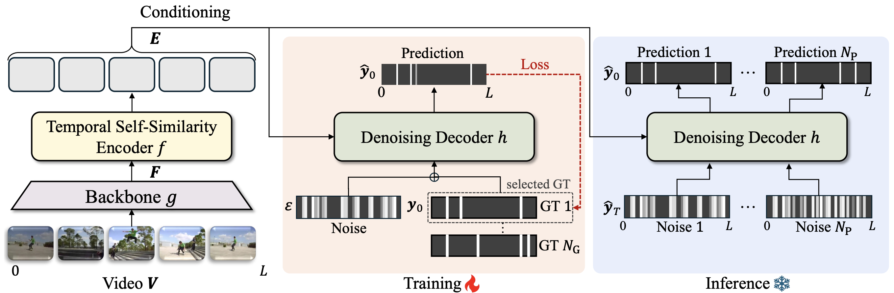

# DiffGEBD: Generic Event Boundary Detection via Denoising Diffusion (ICCV 2025)

Official Implementation of our ICCV Paper https://arxiv.org/pdf/2508.12084:
> **DiffGEBD: Generic Event Boundary Detection via Denoising Diffusion** <br>
> [Jaejun Hwang*](https://hwangjaejun.github.io/), [Dayoung Gong*](https://gongda0e.github.io/), [Manjin Kim](https://kimmanjin.github.io/), and Minsu Cho <br>
> *ICCV, Hawaii, 2025*

<p align="center">
  
</p>

___
## 1. Installation

### System Requirements
- Python 3.10.13
- CUDA 11.8
- PyTorch 2.1.0

### Install Environments
```bash
conda env create -f requirements.yaml
conda activate base
```

## 2. Dataset Setup

### Kinetics-GEBD
Download Kinetics-400 from https://github.com/cvdfoundation/kinetics-dataset and uniformly sample 100 frames. The image files should be named as 'img_*****.jpg'.

*Some videos cannot download from YouTube. ./data/file_list.pkl contains names of the available videos. If any video in the list is unavailable, modify the file_list.pkl accordingly. 

### TAPOS
Download TAPOS from https://opendatalab.com/OpenDataLab/TAPOS/download
or https://sdolivia.github.io/TAPOS/.

## 3. Training

Set your dataset path and start training:

```bash
CUDA_VISIBLE_DEVICES=<GPU_IDS> \
        torchrun --nproc_per_node=<NUM_GPUS> --master_port=<PORT> train.py --local_rank 0 \
            --config-file ./config/config.yaml \
            --gebd_data_dir /path/to/your/kinetics_folder/ \
            --tapos_data_dir /path/to/your/tapos_folder/
```

**Note:** 
- Replace `<GPU_IDS>` with your GPU IDs (e.g., `0,1,2,3` for 4 GPUs)
- Replace `<NUM_GPUS>` with the number of GPUs you want to use
- Replace `<PORT>` with an available port number (e.g., `10210`)
- Modify `--gebd_data_dir` and `--tapos_data_dir` to point to your dataset directories
- You can also use environment variables: `export GEBD_ROOT=/path/to/kinetics` and `export TAPOS_ROOT=/path/to/tapos`

## 4. Inference

1. Download checkpoints and config files from [this link](https://drive.google.com/drive/folders/1SXm1kq84XAp-6pwoR8SdqRLuyGxGC_fJ?usp=drive_link)

2. Set the paths and run inference:

```bash
CUDA_VISIBLE_DEVICES=<GPU_IDS> \
        torchrun --nproc_per_node=<NUM_GPUS> --master_port=<PORT> train.py --local_rank 0 \
            --config-file ./checkpoints/kinetics-gebd/config.yaml \
            --gebd_data_dir /path/to/your/kinetics_folder/ \
            --test-only \
            --resume ./checkpoints/kinetics-gebd/model_best.pth \
            --seed 42 \
            SOLVER.BATCH_SIZE 2 \
            DIFFUSION.SAMPLING_TIMESTEPS 32 \
            DIFFUSION.CFG_SCALE 7.0
```

**Note:**
- Replace `<GPU_IDS>` with your GPU IDs (e.g., `0,1,2,3` for 4 GPUs)
- Replace `<NUM_GPUS>` with the number of GPUs you want to use
- Replace `<PORT>` with an available port number (e.g., `10210`)
- Modify `--config-file` and `--resume` paths to your downloaded checkpoint and config files
- Adjust `--gebd_data_dir` to your dataset path
- You can modify `SOLVER.BATCH_SIZE`, `DIFFUSION.SAMPLING_TIMESTEPS`, and `DIFFUSION.CFG_SCALE` as needed

## 5. Calculating Metrics

Use jupyter-notebook `./utils/calc_metrics.ipynb`

- For Kinetics-GEBD, ground-truth file is `./data/k400_mr345_val_min_change_duration0.3.pkl`
- For TAPOS, ground-truth file is `./data/TAPOS_for_GEBD_val.pkl`

## 6. Acknowledgement & Citation

This repository builds upon the [EfficientGEBD](https://github.com/Ziwei-Zheng/EfficientGEBD) codebase. We thank the original authors for sharing their work.

If you find our code or paper helpful, please consider citing both DiffGEBD and EfficientGEBD:

```bibtex
@inproceedings{hwang2025generic,
  title={Generic Event Boundary Detection via Denoising Diffusion},
  author={Hwang, Jaejun and Gong, Dayoung and Kim, Manjin and Cho, Minsu},
  booktitle={Proceedings of the IEEE/CVF International Conference on Computer Vision},
  pages={14084--14094},
  year={2025}
}

@inproceedings{zheng2024rethinking,
  title={Rethinking the architecture design for efficient generic event boundary detection},
  author={Zheng, Ziwei and Zhang, Zechuan and Wang, Yulin and Song, Shiji and Huang, Gao and Yang, Le},
  booktitle={Proceedings of the 32nd ACM International Conference on Multimedia},
  pages={1215--1224},
  year={2024}
}
```
---

## 📄 License

This project is licensed under the [MIT License](./LICENSE).